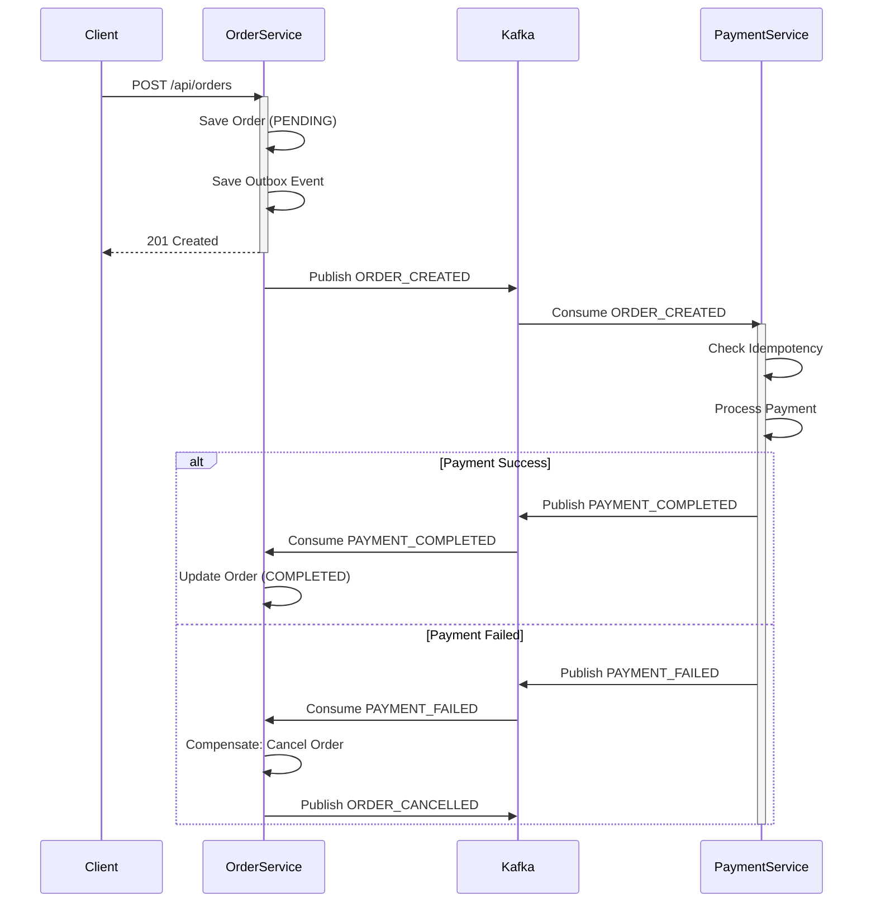
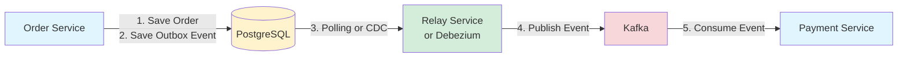
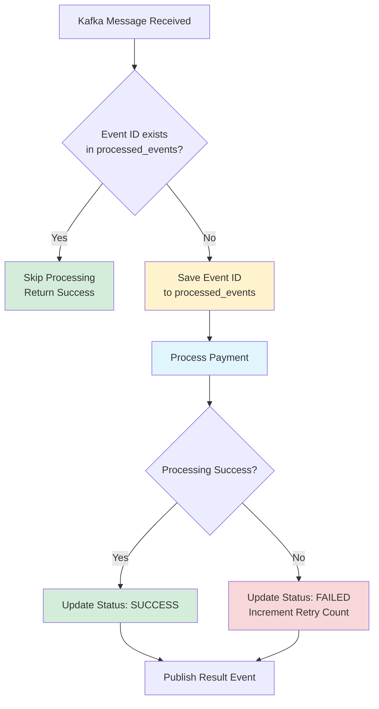
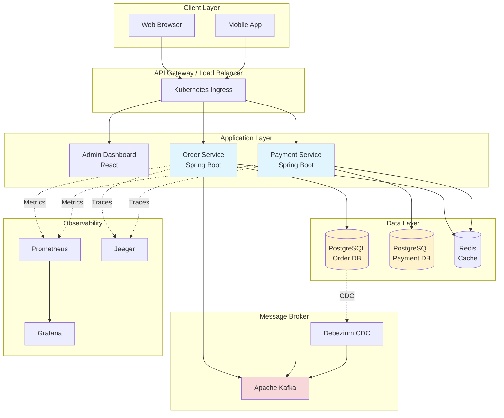

# 🚀 이벤트 기반 주문-결제 마이크로서비스

**분산 트랜잭션 정합성을 보장하는 엔터프라이즈급 Event-Driven Microservices Architecture**

Spring Boot 3, Java 17, Kafka, Saga Pattern, Transactional Outbox를 활용한 프로덕션 레디 MSA 프로젝트

[](https://github.com/username/order-payment-msa/actions)
[](https://opensource.org/licenses/MIT)

## ⚡ 빠른 시작 (1분)

```bash
# 1. .env 설정
cp .env.example .env

# 2. 시스템 시작
./start.sh

# 3. 상태 확인
./check-health.sh

# 4. API 테스트
./test-api.sh
```

**자세한 가이드**: [QUICKSTART.md](QUICKSTART.md)를 참고하세요.

---

## 📋 목차

- [프로젝트 소개](#프로젝트-소개)
- [핵심 기술 & 패턴](#핵심-기술--패턴)
- [시스템 아키텍처](#시스템-아키텍처)
- [기술 스택](#기술-스택)
- [빠른 시작](#빠른-시작)
- [API 문서](#api-문서)
- [테스트](#테스트)
- [배포](#배포)
- [모니터링](#모니터링)
- [트러블슈팅](#트러블슈팅)

## 📝 프로젝트 소개

이 프로젝트는 **분산 환경에서의 데이터 정합성 문제를 해결**하는 것에 중점을 둔 엔터프라이즈급 마이크로서비스 아키텍처입니다.

### 🎯 핵심 목표

- ✅ **분산 트랜잭션 정합성**: Saga Pattern으로 서비스 간 트랜잭션 일관성 보장
- ✅ **메시지 신뢰성**: Transactional Outbox로 이벤트 발행 원자성 보장
- ✅ **멱등성**: 네트워크 재시도로 인한 중복 처리 방지
- ✅ **고가용성**: Kubernetes HPA & KEDA로 자동 스케일링
- ✅ **관찰성**: 분산 추적, 로깅, 메트릭 수집

### 🏗️ 비즈니스 시나리오

1. 고객이 주문을 생성합니다
2. 주문 서비스가 주문을 저장하고 이벤트를 발행합니다
3. 결제 서비스가 이벤트를 수신하여 결제를 처리합니다
4. 결제 성공 시 주문이 완료되고, 실패 시 **보상 트랜잭션**으로 주문이 취소됩니다

## 🎨 핵심 기술 & 패턴

### 1. Saga Pattern (Choreography 방식)

분산 트랜잭션을 관리하는 패턴으로, 각 서비스가 로컬 트랜잭션을 실행하고 이벤트를 발행합니다.



### 2. Transactional Outbox Pattern

DB 업데이트와 이벤트 발행의 원자성을 보장합니다.



**구현 방식**:
- **Polling 방식**: 주기적으로 Outbox 테이블을 조회하여 미발행 이벤트 처리
- **CDC 방식**: Debezium으로 DB 변경사항을 실시간으로 Kafka에 전송 (권장)

### 3. Idempotency (멱등성)

중복 메시지 처리를 방지합니다.



## 🏛️ 시스템 아키텍처

### 전체 아키텍처



## 🛠 기술 스택

### Backend
- **Java 17** - LTS 버전
- **Spring Boot 3.2.2** - 최신 프레임워크
- **Spring Data JPA** - ORM
- **Spring Kafka** - 이벤트 Pub/Sub
- **PostgreSQL 16** - 관계형 데이터베이스

### Event Streaming
- **Apache Kafka 7.5.0** - 분산 메시징 시스템
- **Debezium 2.5** - Change Data Capture (CDC)
- **Zookeeper** - Kafka 클러스터 관리

### Caching & Session
- **Redis 7** - 분산 캐시 & 세션 저장소

### Frontend
- **React 18** - UI 라이브러리
- **Material-UI 5** - UI 컴포넌트
- **Axios** - HTTP 클라이언트

### DevOps
- **Docker** - 컨테이너화
- **Docker Compose** - 로컬 개발 환경
- **Kubernetes** - 오케스트레이션
- **Helm** - K8s 패키지 매니저
- **GitHub Actions** - CI/CD 파이프라인

### Testing
- **JUnit 5** - 단위 테스트
- **Testcontainers** - 통합 테스트
- **Awaitility** - 비동기 테스트

## 🚀 빠른 시작

### 사전 요구사항

- Docker & Docker Compose
- JDK 17+
- Maven 3.8+
- Node.js 18+ (Admin Dashboard용)

### 1분 만에 환경 구축

```bash
# 1. 저장소 클론
git clone https://github.com/username/order-payment-msa.git
cd order-payment-msa

# 2. 스크립트 실행 권한 부여
chmod +x start.sh

# 3. 전체 시스템 실행 (단 1개 명령어!)
./start.sh

# 또는 Docker Compose로 직접 실행
docker-compose up -d
```

**실행 후 접속 URL**:
- 📊 Admin Dashboard: http://localhost:3000
- 🛒 Order Service API: http://localhost:8080
- 💳 Payment Service API: http://localhost:8081
- 📈 Kafka UI: http://localhost:8090
- 🔧 Debezium Connect: http://localhost:8083

### 서비스 상태 확인

```bash
# 모든 컨테이너 상태 확인
docker-compose ps

# 로그 확인
docker-compose logs -f order-service
docker-compose logs -f payment-service

# Kafka 토픽 확인
docker exec -it kafka kafka-topics --bootstrap-server localhost:9092 --list
```

## 📚 API 문서

### Order Service

#### 주문 생성

```bash
POST http://localhost:8080/api/orders
Content-Type: application/json

{
  "productName": "MacBook Pro 16",
  "quantity": 1,
  "price": 3500000,
  "customerName": "김철수",
  "customerEmail": "kim@example.com"
}

# Response 201 Created
{
  "id": 1,
  "orderNumber": "ORD-A1B2C3D4",
  "productName": "MacBook Pro 16",
  "quantity": 1,
  "price": 3500000,
  "totalAmount": 3500000,
  "customerName": "김철수",
  "customerEmail": "kim@example.com",
  "status": "PENDING",
  "createdAt": "2026-02-02T10:30:00"
}
```

#### 주문 조회

```bash
# 전체 주문 조회
GET http://localhost:8080/api/orders

# 특정 주문 조회
GET http://localhost:8080/api/orders/{id}

# 주문 번호로 조회
GET http://localhost:8080/api/orders/number/{orderNumber}
```

### Payment Service

#### 결제 조회

```bash
# 전체 결제 조회
GET http://localhost:8081/api/payments

# 특정 결제 조회
GET http://localhost:8081/api/payments/{id}

# 주문 번호로 결제 조회
GET http://localhost:8081/api/payments/order/{orderNumber}
```

### Health Check

```bash
# Order Service 헬스 체크
curl http://localhost:8080/actuator/health

# Payment Service 헬스 체크
curl http://localhost:8081/actuator/health
```

## 🧪 테스트

### 단위 테스트 실행

```bash
# Order Service
cd order-service
mvn test

# Payment Service
cd payment-service
mvn test
```

### 통합 테스트 (Testcontainers)

```bash
# 전체 통합 테스트 실행
mvn verify

# 특정 테스트 클래스 실행
mvn test -Dtest=OrderServiceIntegrationTest
mvn test -Dtest=PaymentServiceIntegrationTest
```

### E2E 시나리오 테스트

```bash
# 주문 생성 -> 결제 완료 시나리오
curl -X POST http://localhost:8080/api/orders \
  -H "Content-Type: application/json" \
  -d '{
    "productName": "Test Product",
    "quantity": 1,
    "price": 10000,
    "customerName": "테스트",
    "customerEmail": "test@example.com"
  }'

# 5초 후 결제 상태 확인
sleep 5
curl http://localhost:8081/api/payments

# 주문 상태 확인 (COMPLETED 또는 CANCELLED)
curl http://localhost:8080/api/orders
```

## 🚢 배포

### Kubernetes 배포

```bash
# 1. Namespace 생성
kubectl apply -f k8s/namespace.yaml

# 2. ConfigMap & Secrets 설정
kubectl apply -f k8s/configmap.yaml

# 3. 데이터베이스 배포
kubectl apply -f k8s/postgres/

# 4. Kafka 배포
kubectl apply -f k8s/kafka/

# 5. 애플리케이션 배포
kubectl apply -f k8s/order-service/
kubectl apply -f k8s/payment-service/

# 6. HPA 설정
kubectl apply -f k8s/order-service/hpa.yaml
kubectl apply -f k8s/payment-service/hpa.yaml
```

### Helm으로 배포

```bash
# Helm Chart 설치
helm install order-payment-msa ./helm \
  --namespace microservices \
  --create-namespace \
  --values ./helm/values.yaml

# 배포 상태 확인
helm status order-payment-msa -n microservices

# 업그레이드
helm upgrade order-payment-msa ./helm -n microservices

# 삭제
helm uninstall order-payment-msa -n microservices
```

### KEDA 설치 (Kafka 기반 오토스케일링)

```bash
# KEDA 설치
helm repo add kedacore https://kedacore.github.io/charts
helm repo update
helm install keda kedacore/keda --namespace keda --create-namespace

# ScaledObject 적용
kubectl apply -f k8s/payment-service/keda-scaledobject.yaml
```

## 📊 모니터링

### 메트릭 확인

```bash
# Prometheus 메트릭 엔드포인트
curl http://localhost:8080/actuator/prometheus
curl http://localhost:8081/actuator/prometheus

# Kafka Consumer Lag 확인
docker exec -it kafka kafka-consumer-groups \
  --bootstrap-server localhost:9092 \
  --group payment-service-group \
  --describe
```

### Kafka UI

Kafka UI (http://localhost:8090)에서 다음을 확인할 수 있습니다:
- 토픽 목록 및 메시지
- Consumer Group 및 Lag
- Broker 상태

## 🔧 트러블슈팅

### 문제: Kafka 연결 실패

```bash
# Kafka 컨테이너 상태 확인
docker-compose ps kafka

# Kafka 로그 확인
docker-compose logs kafka

# Kafka 재시작
docker-compose restart kafka
```

### 문제: 이벤트가 발행되지 않음

```bash
# Outbox 테이블 확인
docker exec -it postgres-order psql -U postgres -d orderdb \
  -c "SELECT * FROM outbox_events WHERE published = false;"

# OutboxEventRelayService 로그 확인
docker-compose logs -f order-service | grep "OutboxEventRelay"
```

### 문제: 중복 결제 발생

```bash
# ProcessedEvent 테이블 확인
docker exec -it postgres-payment psql -U postgres -d paymentdb \
  -c "SELECT * FROM processed_events ORDER BY processed_at DESC LIMIT 10;"
```

## 📖 학습 포인트

### 1. 분산 트랜잭션 관리
- Saga Pattern을 통한 분산 트랜잭션 조율
- 보상 트랜잭션 (Compensation) 구현
- 최종 일관성 (Eventual Consistency) 보장

### 2. 메시지 신뢰성
- Transactional Outbox로 At-least-once 보장
- 멱등성 키를 통한 Exactly-once 시맨틱 구현
- Dead Letter Queue 처리

### 3. 확장성
- Kubernetes HPA로 트래픽 대응
- KEDA로 Kafka Consumer Lag 기반 스케일링
- 무상태(Stateless) 서비스 설계

### 4. 관찰성 (Observability)
- 구조화된 로깅 (Structured Logging)
- 분산 추적 (Distributed Tracing)
- 메트릭 수집 및 대시보드

## 📁 프로젝트 구조

```
order-payment-msa/
├── .github/
│   └── workflows/
│       ├── ci-cd.yml                 # CI/CD 파이프라인
│       └── dependency-review.yml     # 의존성 보안 검토
├── order-service/
│   ├── src/
│   │   ├── main/java/.../
│   │   │   ├── entity/
│   │   │   │   ├── Order.java
│   │   │   │   └── OutboxEvent.java      # Outbox 패턴
│   │   │   ├── service/
│   │   │   │   ├── OrderService.java
│   │   │   │   └── OutboxEventRelayService.java
│   │   │   ├── event/
│   │   │   │   └── PaymentEventConsumer.java  # Saga 보상 트랜잭션
│   │   │   └── ...
│   │   └── test/
│   │       └── integration/
│   │           └── OrderServiceIntegrationTest.java
│   ├── Dockerfile
│   └── pom.xml
├── payment-service/
│   ├── src/
│   │   ├── main/java/.../
│   │   │   ├── entity/
│   │   │   │   ├── Payment.java
│   │   │   │   └── ProcessedEvent.java      # 멱등성 키
│   │   │   ├── service/
│   │   │   │   └── PaymentService.java      # 멱등성 로직
│   │   │   └── ...
│   │   └── test/
│   │       └── integration/
│   │           └── PaymentServiceIntegrationTest.java
│   ├── Dockerfile
│   └── pom.xml
├── admin-dashboard/
│   ├── src/
│   ├── Dockerfile
│   └── package.json
├── k8s/
│   ├── namespace.yaml
│   ├── configmap.yaml
│   ├── order-service/
│   │   ├── deployment.yaml
│   │   └── hpa.yaml                 # Horizontal Pod Autoscaler
│   ├── payment-service/
│   │   ├── deployment.yaml
│   │   ├── hpa.yaml
│   │   └── keda-scaledobject.yaml  # Kafka Lag 기반 스케일링
│   └── ...
├── helm/
│   ├── Chart.yaml
│   ├── values.yaml
│   └── templates/
│       ├── configmap.yaml
│       └── order-service.yaml
├── docker-compose.yml               # 로컬 개발 환경
├── start.sh                         # 원클릭 실행 스크립트
└── README.md
```

## 🤝 기여

Pull Request는 언제나 환영합니다!

1. Fork the Project
2. Create your Feature Branch (`git checkout -b feature/AmazingFeature`)
3. Commit your Changes (`git commit -m 'Add some AmazingFeature'`)
4. Push to the Branch (`git push origin feature/AmazingFeature`)
5. Open a Pull Request

## 📄 라이선스

이 프로젝트는 MIT 라이선스 하에 배포됩니다.

## 📞 문의

프로젝트 관련 문의: dev@example.com

---

**⭐ 이 프로젝트가 도움이 되었다면 Star를 눌러주세요!**
- **Docker & Docker Compose** - 컨테이너화
- **Kubernetes** - 오케스트레이션
- **Maven** - 빌드 도구

## 🏗 시스템 아키텍처

```
┌─────────────────────────────────────────────────────────────┐
│              React Admin Dashboard (Port 3000)               │
│                   실시간 주문/결제 현황 조회                  │
└────────────────┬────────────────────────────────┬───────────┘
                 │ REST API                       │ REST API
                 ▼                                ▼
┌──────────────────────────────┐    ┌──────────────────────────────┐
│   Order Service (Port 8080)  │    │  Payment Service (Port 8081) │
│   - 주문 생성/조회             │    │  - 결제 자동 처리             │
│   - Kafka Producer           │    │  - Kafka Consumer            │
│   - PostgreSQL (Port 5432)   │    │  - PostgreSQL (Port 5433)    │
└───────────────┬──────────────┘    └──────────────┬───────────────┘
                │                                  │
                │ Publish Event                    │ Consume Event
                │ Topic: order.created             │ Topic: order.created
                │                                  │
                └────────►┌──────────────┐◄────────┘
                          │    Kafka     │
                          │ (Port 9092)  │
                          └──────────────┘
```

## 📁 프로젝트 구조

```
prj-java/
├── order-service/              # 주문 마이크로서비스
│   ├── src/main/java/com/example/orderservice/
│   │   ├── OrderServiceApplication.java
│   │   ├── controller/         # REST API 컨트롤러
│   │   ├── service/            # 비즈니스 로직
│   │   ├── repository/         # JPA 리포지토리
│   │   ├── entity/             # 엔티티 (Order)
│   │   ├── dto/                # DTO 객체
│   │   ├── event/              # Kafka 이벤트 발행
│   │   └── config/             # Kafka Producer 설정
│   ├── Dockerfile
│   └── pom.xml
│
├── payment-service/            # 결제 마이크로서비스
│   ├── src/main/java/com/example/paymentservice/
│   │   ├── PaymentServiceApplication.java
│   │   ├── controller/         # REST API 컨트롤러
│   │   ├── service/            # 비즈니스 로직
│   │   ├── repository/         # JPA 리포지토리
│   │   ├── entity/             # 엔티티 (Payment)
│   │   ├── dto/                # DTO 객체
│   │   ├── event/              # Kafka 이벤트 소비
│   │   └── config/             # Kafka Consumer 설정
│   ├── Dockerfile
│   └── pom.xml
│
├── admin-dashboard/            # React 관리 대시보드
│   ├── src/
│   │   ├── components/         # React 컴포넌트
│   │   ├── services/           # API 호출 서비스
│   │   ├── App.jsx
│   │   └── index.js
│   ├── Dockerfile
│   └── package.json
│
├── k8s/                        # Kubernetes 배포 설정
│   ├── namespace.yaml
│   ├── configmap.yaml
│   ├── kafka/
│   ├── postgres/
│   ├── order-service/
│   ├── payment-service/
│   └── admin-dashboard/
│
├── docker-compose.yml          # Docker Compose 설정
└── README.md
```

## 🚀 실행 방법

### 사전 요구사항

**Docker Compose로 실행 시:**
- Docker Desktop (macOS/Windows) 또는 Docker Engine + Docker Compose (Linux)
- 최소 8GB RAM 권장

**Kubernetes로 실행 시:**
- Docker Desktop (Kubernetes 활성화) 또는 Minikube
- kubectl CLI

### Docker Compose로 실행

**호스트에 Java, Node.js, Kafka 등을 설치할 필요가 없습니다!**
Docker만 있으면 모든 것이 컨테이너로 실행됩니다.

1. **프로젝트 디렉토리로 이동**
```bash
cd /Users/chanyoungyoon/workspace/restart/prj-java
```

2. **Docker Compose로 모든 서비스 실행**
```bash
docker-compose up --build
```

초기 빌드 시 5-10분 정도 소요됩니다. 이후 실행은 빠릅니다.

3. **서비스 접속**
- 📊 **Admin Dashboard**: http://localhost:3000
- 🛒 **Order Service API**: http://localhost:8080
- 💳 **Payment Service API**: http://localhost:8081

4. **로그 확인**
```bash
# 모든 서비스 로그
docker-compose logs -f

# 특정 서비스 로그
docker-compose logs -f order-service
docker-compose logs -f payment-service
docker-compose logs -f kafka
```

5. **서비스 중지**
```bash
# 컨테이너 중지
docker-compose down

# 컨테이너 + 볼륨(데이터) 삭제
docker-compose down -v
```

### Kubernetes로 실행

1. **Docker 이미지 빌드**
```bash
# Order Service 이미지 빌드
cd order-service
docker build -t order-service:1.0.0 .

# Payment Service 이미지 빌드
cd ../payment-service
docker build -t payment-service:1.0.0 .

# Admin Dashboard 이미지 빌드
cd ../admin-dashboard
docker build -t admin-dashboard:1.0.0 .

cd ..
```

2. **Kubernetes 리소스 배포**
```bash
# Namespace 생성
kubectl apply -f k8s/namespace.yaml

# ConfigMap & Secret 생성
kubectl apply -f k8s/configmap.yaml

# PostgreSQL 배포
kubectl apply -f k8s/postgres/postgres-order-deployment.yaml
kubectl apply -f k8s/postgres/postgres-payment-deployment.yaml

# Kafka & Zookeeper 배포
kubectl apply -f k8s/kafka/zookeeper-deployment.yaml
kubectl apply -f k8s/kafka/kafka-deployment.yaml

# 서비스 배포 (의존성이 준비될 때까지 30초 대기)
sleep 30
kubectl apply -f k8s/order-service/deployment.yaml
kubectl apply -f k8s/payment-service/deployment.yaml
kubectl apply -f k8s/admin-dashboard/deployment.yaml
```

3. **배포 상태 확인**
```bash
kubectl get pods -n microservices
kubectl get services -n microservices
```

4. **서비스 접속**
```bash
# LoadBalancer 타입의 External IP 확인
kubectl get svc -n microservices

# Minikube 사용 시
minikube service admin-dashboard-service -n microservices
```

5. **정리**
```bash
kubectl delete namespace microservices
```

## 📡 API 문서

### Order Service API

#### 1. 주문 생성
```http
POST /api/orders
Content-Type: application/json

{
  "productName": "MacBook Pro",
  "quantity": 1,
  "price": 2500000,
  "customerName": "홍길동",
  "customerEmail": "hong@example.com"
}
```

**Response:**
```json
{
  "id": 1,
  "orderNumber": "ORD-A1B2C3D4",
  "productName": "MacBook Pro",
  "quantity": 1,
  "price": 2500000,
  "totalAmount": 2500000,
  "customerName": "홍길동",
  "customerEmail": "hong@example.com",
  "status": "PENDING",
  "createdAt": "2026-02-02T10:30:00",
  "updatedAt": "2026-02-02T10:30:00"
}
```

#### 2. 모든 주문 조회
```http
GET /api/orders
```

#### 3. 주문 ID로 조회
```http
GET /api/orders/{id}
```

#### 4. 주문 번호로 조회
```http
GET /api/orders/number/{orderNumber}
```

### Payment Service API

#### 1. 모든 결제 조회
```http
GET /api/payments
```

#### 2. 결제 ID로 조회
```http
GET /api/payments/{id}
```

#### 3. 주문 번호로 결제 조회
```http
GET /api/payments/order/{orderNumber}
```

### cURL 예제

```bash
# 주문 생성
curl -X POST http://localhost:8080/api/orders \
  -H "Content-Type: application/json" \
  -d '{
    "productName": "iPhone 15 Pro",
    "quantity": 2,
    "price": 1500000,
    "customerName": "김철수",
    "customerEmail": "kim@example.com"
  }'

# 주문 목록 조회
curl http://localhost:8080/api/orders

# 결제 목록 조회
curl http://localhost:8081/api/payments
```

## 🎓 학습 포인트

### 1. 이벤트 기반 아키텍처 (EDA)
- **비동기 통신**: REST API와 달리 서비스 간 직접 호출 없이 이벤트로 통신
- **느슨한 결합**: Order Service와 Payment Service가 독립적으로 동작
- **확장성**: 이벤트 구독자를 추가하여 기능 확장 가능

### 2. Kafka 메시징
- **Producer**: Order Service가 주문 이벤트 발행
- **Consumer**: Payment Service가 주문 이벤트 소비
- **Topic**: `order.created` 토픽으로 이벤트 전달

### 3. 마이크로서비스 패턴
- **Database per Service**: 각 서비스가 독립적인 데이터베이스 소유
- **API Gateway 패턴**: React 대시보드가 각 서비스 API 호출
- **Health Check**: Spring Boot Actuator로 서비스 상태 모니터링

### 4. 트랜잭션 관리
- **로컬 트랜잭션**: 각 서비스 내에서 @Transactional 사용
- **이벤트 발행**: 트랜잭션 커밋 후 Kafka 이벤트 발행
- **최종 일관성(Eventual Consistency)**: 분산 시스템의 일관성 보장

### 5. Docker & Kubernetes
- **컨테이너화**: 각 서비스를 독립적인 컨테이너로 패키징
- **오케스트레이션**: Kubernetes로 서비스 배포 및 스케일링
- **ConfigMap/Secret**: 환경 설정 외부화

## 🔍 이벤트 플로우 상세

1. **사용자**: Admin Dashboard에서 주문 생성
2. **Order Service**: 
   - 주문 정보를 `orders` 테이블에 저장
   - 주문 이벤트를 Kafka `order.created` 토픽에 발행
3. **Kafka**: 이벤트를 큐에 저장
4. **Payment Service**:
   - `order.created` 토픽의 이벤트 소비
   - 결제 처리 로직 실행 (90% 성공률)
   - 결제 정보를 `payments` 테이블에 저장
5. **Admin Dashboard**: 
   - 5초마다 자동으로 주문/결제 목록 새로고침
   - 실시간으로 상태 변화 확인

## 📚 참고 자료

- [Spring Boot Documentation](https://spring.io/projects/spring-boot)
- [Spring Kafka Documentation](https://spring.io/projects/spring-kafka)
- [Apache Kafka Documentation](https://kafka.apache.org/documentation/)
- [Kubernetes Documentation](https://kubernetes.io/docs/)
- [React Documentation](https://react.dev/)

## 📄 라이센스

이 프로젝트는 학습 목적으로 제작되었습니다.

## 👨‍💻 개발자

**학습 프로젝트** - PHP 개발자의 Java & Spring Boot & Kafka 학습용

---

**Happy Coding! 🚀**
